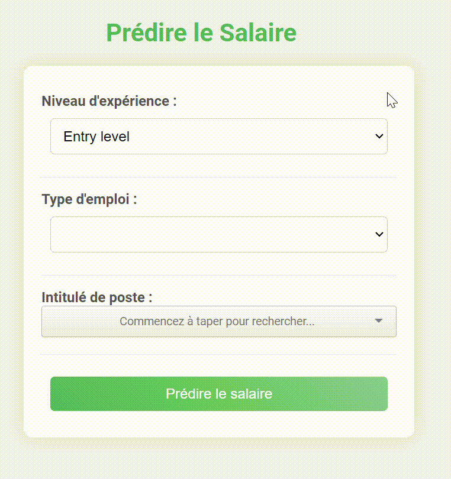

# Salary Prediction App

This project is a Salary Prediction System built with Flask, using Sklearn for machine learning. The application allows users to predict salaries based on job-related data such as job title, experience level, and employment type. It offers a user-friendly interface where users can easily input their experience level, employment type, and job title, and the system will predict their potential salary. Designed for simplicity and efficiency, the app provides valuable insights into earnings in the U.S. job market.

## Demo

[](assets/demo.gif)

## Setup Instructions

### Prerequisites

- Python 3.10 or higher
- pip (Python package installer)
- Docker (optional, for containerized deployment)

### 1. Clone the Repository

```bash
git clone https://github.com/amine-el-amrani/salary-predection.git
cd salary-predection
```

### 2. (Optional) Create and Activate the Virtual Environment
If you plan to run the application locally without Docker, you need to set up a Python environment:

```bash
python3 -m venv venv
```

Activate the virtual environment:
```bash
# On Windows
venv\Scripts\activate

# On macOS/Linux
source venv/bin/activate
```
### 3. (Optional) Install Requirements
Install the necessary dependencies using pip.

```bash
pip install -r requirements.txt
```

### 4. Train the Model (Optional)
If you wish to retrain the model with a new dataset:

```bash
python data_preparation.py
python model_optimization.py
```

### 5. Run the Flask Application

#### Option 1: Running Locally
If you're running locally, start the Flask application:

```bash
python app.py
```
The server will be running at http://127.0.0.1:5000.

#### Option 1: Running with Docker
Build the Docker image:

```bash
docker build -t salary-prediction-app .
```
Run the Docker container:

```bash
docker run -p 5000:5000 salary-prediction-app
```
### 6. Access the Application
Once the application is running, open your browser and navigate to:

```bash
http://127.0.0.1:5000
```
You can enter your job-related information (experience level, employment type, job title) and get a salary prediction.

### 7. Project Structure
 
```bash
│
├── .dockerignore             # Docker ignore file
├── Dockerfile                # Docker configuration file
├── README.md                 # Project documentation
├── app.py                    # Flask application
├── data_preparation.py       # Data cleaning and preparation script
├── model_optimization.py     # Model training and optimization script
├── requirements.txt          # Project dependencies
├── templates/                # HTML templates for the web interface
│   ├── index.html
│   └── result.html
├── models/                   # Directory to save trained models
│   └── optimized_salary_prediction_model.pkl
├── data/                     # Directory for datasets and preprocessed data
│   ├── Dataset_salary_2024.csv
│   ├── X_train.csv
│   ├── X_val.csv
│   └── X_test.csv
```

### 8. Deploymentl

Download and install ngrok
Run the following command in your terminal to expose the application online:

```bash
ngrok http 5000
```

### 9. Contributing

Contributions are welcome! If you have suggestions to improve the application or would like to add features, feel free to open an issue or submit a pull request.
